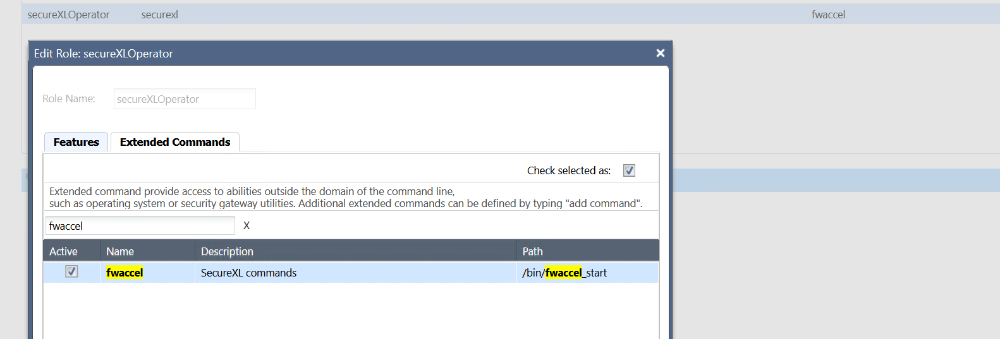
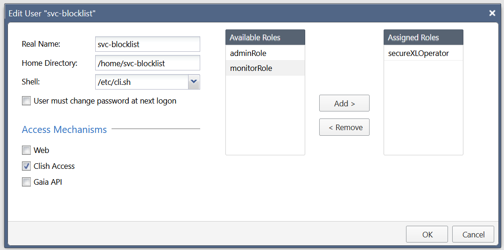
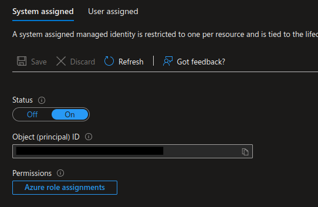
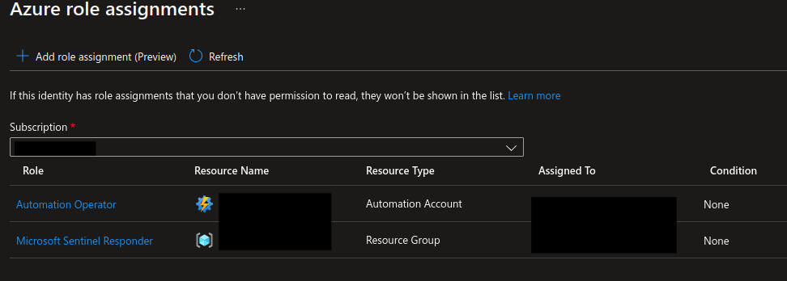
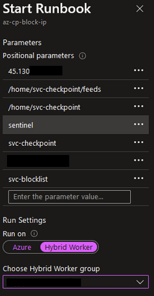

# Automate Your Blocklists

Automate Your Blocklists, this repository accompanies presentation from CPX 2024 Las Vegas.

Presented by Thomas Dang in 2024.

## Purpose

Automating your blocklists using SecureXL has significantly higher performance than utilizing dynamic blocklists and conventional object based blocks in Check Point firewalls (R81.20 and lower at time of publication). This means that in environments where there is heavy traffic, or otherwise heavy load on the firewall, as many blocks as possible should be migrated from conventional FW Rules to the SecureXL ruleset.

## Setup Guide

This automated blocking has several moving pieces, notably it contains the following mandatory servers/services:

- Check Point Gateway (R80 or higher utilizing Gaia)
- Microsoft Sentinel with Logic Apps (playbooks)
- Azure Automation Account with runbooks
- Hybrid Worker on-premise server (your preferred flavour of linux, tested on Debian 11)

Note that the configuration of your Azure environment is out of scope of this workshop and you should contact your Microsoft Account representative if assistance is required.

### High-Level Overview

In my lab environment, the blocking is implemented using a cron job that fires a script periodically to sync the gateway to the hybrid runbook automation server. This allows for automated updating of our blocklists on an interval. The list is also live updated dynamically from our Sentinel SIEM/SOAR using a Logic App that calls a runbook which connects to the gateway and blocks the malicious IPs.

### Authentication

A custom user role is created on the gateway named "secureXLOperator". This role only allows access to the secureXL commands. Web access is disabled for this service account. This account only requires clish access and does not require expert mode.




### Automation

#### Hybrid Worker

Although fully configuring a hybrid worker is out of scope of this workshop, I will touch on a few key points.

Do not use a fully privilged root account on your hybrid worker to perform these actions. Although the worker itself will run as root, you will want to install keys and utilize a user account that has lower privileges for the actual transferring of files and commands to and from the gateway.

Provision a user account on your server using whatever method you are most accustomed, I typically use the `useradd` commands and install the appropriate groups. Ensure you generate an ssh-key using `ssh-keygen` and install the ssh public key you will generate on the gateway in your `.ssh/authorized_keys`.

##### SSH Restrictions

Only allow the gateway to use SFTP to access files on this system. You do not need to allow full SSH or code execution.

Add the following lines to your `sshd_config` to ensure that your service account can only utilize SFTP. You should test this to ensure you have configured it correctly. Replace the username with whatever user you had created for the remote access.

```
# ovverride default of no subsystems
Subsystem    sftp    /usr/lib/openssh/sftp-server
Subsystem    svc-checkpoint    internal-sftp
```

##### Blocklist automations

You can download additional threat feeds using the following script: [cpblock.sh](bash-scripts/hybrid-worker/cpblock.sh)

These blocklists are configured to save to `[script_directory]/feeds`. For convenience, I recommend placing this in the home folder of the service account as the sftp connection will default to this directory.

#### Gateway

In our lab, we have installed a script in this service accounts home directory. The home directory is not overwritten when the system is updated, so is an appropriate location for long lived scripts. There is some debate in CheckMates regarding the ideal location, but this has worked for us.

[Gateway Block Script](bash-scripts/gateway/sync-blocklist.sh)

A cron job is installed which can be used to run the script as necessary.

```
$ crontab -u svc-blocklist -e

0 */2 * * * /home/svc-blocklist/scripts/sync-blocklist.sh
```

This interval can be configured as frequently as you like, it is unlikely to be necessary significantly greater than once per hour. It may be preferred to configure this from Gaia portal, as that will have a higher likelihood of being backed up through your various backup automations.

Generate an SSH key as we did above using `ssh-keygen`, install the public key in the `authorized_keys` section of your automation server and vice versa for the public key generated from the automation server into the gateway account's `authorized_keys`.

#### Microsoft Sentinel

Ensuring your Azure environment is secure is extremely important, as organizations begin hybrid migrations or full cloud setups, the ability to perform privileged actions as a malicious service principal or managed identity increase the exposure to your environment with often obtuse or limited visibility. 

##### Logic App

Configuring the Logic App/Playbook with a system-assigned managed identity is considered best practice to minimize your risk of lateral movement. This identity requires two roles:

- Sentinel Responder
    - Required for adding comments to incidents
    - This can be restricted to the appropriate resource group
- Automation Operator
    - Used for running the automation/runbook. Can be limited to the single automation account that the hybrid worker is assigned to.




##### Automation Account

No special permissions are required as all work is done within the hybrid worker.

## Script Details

### az-cp-block-ip.py

A hybrid worker is configured from Azure to be able to automatically send IP blocks to the firewall. This is setup using a Debian server hosted on-premises in our ESXI environment. 

This hybrid worker utilizes a python script (Appendix C) that accepts positional parameters: 

1. IP Address to block
2. Feed directory
3. Data directory
4. Block file name (no extension)
5. User account (of service worker)

These parameters can be seen called from the runbook azure portal as follows: 



The script takes the submitted IP address, updates the date in the pickled dictionary, and saves the latest block file to the feed directory. This blockfile will only contain IP addresses which have been submitted to the runbook in the last 7 days.  

The SSH key for the service account is installed on the service account on the gateway.

The script finally executes a fabric command which is an optional parameter[6/7] to the python program. Multiple gateways can be specified using commas. This code uses the fabric library to run an ssh command which executes the fwaccel dos deny -a [IP] on the gateways.

Automations can be used to run the playbook that calls this hybrid worker on any incident type you can customize in Sentinel. We alert off of the CommonSecurityLog when certain alarm thresholds are met.