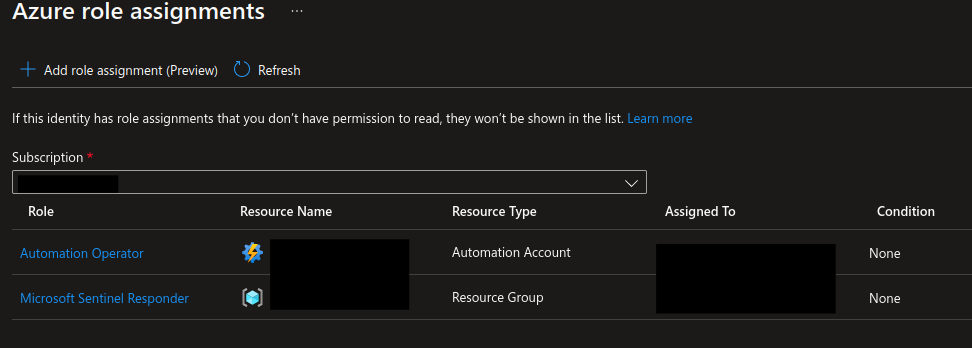
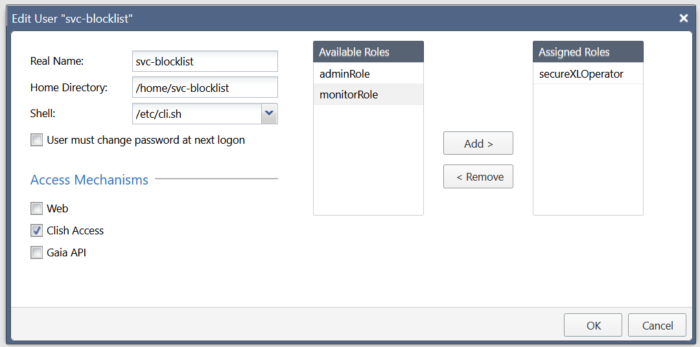

# Permissions

Permissions should be limited to least privilege. This means ensuring that managed identities are granted the appropriate Azure RBAC assignments.

## LogicApp

The logic app will require the Automation Operator (limited to the automation account you create for this worker) and Microsoft Sentinel Responder to allow for executing the script and adding a comment to the incident.

## Check Point Gateway

On the gateway, you should create an account that is only permitted to utilize the SecureXLOperator role. This is the minimum required permission to perform blocks in the SecureXL rules. This can be performed in the Gaia Web UI.

## Hybrid Worker

The runbook in Azure does not require special permissions. This is due to all commands being executed locally on the hybrid worker environment.